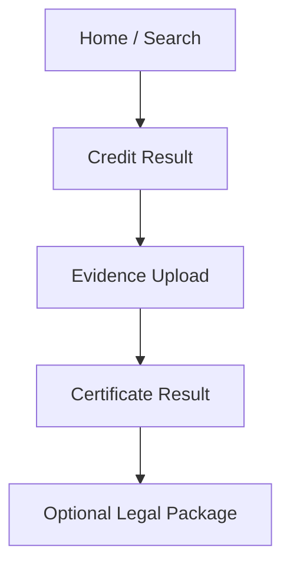

# TradeGuard Low-Fidelity Prototype

## Purpose

This document is the low-fidelity prototype for the current MVP.
It is intended to give product, engineering, and design a shared page structure before final UI polish.

## Primary User Flow



## Screen 1: Home / Search

### Goal

- allow the user to search a US buyer quickly
- make the next action obvious

### Layout

```text
+------------------------------------------------------+
| TradeGuard                                            |
| Buyer risk check for US counterparties                |
|------------------------------------------------------|
| [ Company name / website / EIN input              ]  |
| [ Optional state selector: CA / Public / Auto     ]  |
|                                                      |
| [ Run Credit Check ]                                 |
|                                                      |
| Recent searches                                      |
| - Apple Inc.                                         |
| - Example Buyer LLC                                  |
+------------------------------------------------------+
```

### Required Elements

- product title
- one main search input
- optional state hint
- primary CTA
- recent search area

## Screen 2: Credit Result

### Goal

- show a simple decision-ready risk snapshot
- make evidence upload the clear next step

### Layout

```text
+------------------------------------------------------+
| Back                                                  |
|------------------------------------------------------|
| Apple Inc.                                            |
| SEC EDGAR                                             |
|------------------------------------------------------|
| Grade: [ A ]          Risk Score: 95                 |
| Match Confidence: High                               |
|                                                      |
| Risk Flags                                            |
| [ MISSING_PUBLIC_WEBSITE ]                           |
|                                                      |
| Company Profile                                       |
| - Jurisdiction: US-CA                                 |
| - Registration: CIK 0000320193                        |
| - Status: SEC Reporting Entity                        |
| - Website: www.apple.com                              |
|                                                      |
| Summary                                               |
| [ human-readable explanation block ]                  |
|                                                      |
| [ Upload Evidence ]                                   |
+------------------------------------------------------+
```

### Required Elements

- company name
- source label
- grade badge
- risk score
- risk flags
- company info block
- summary text
- upload CTA

## Screen 3: Evidence Upload

### Goal

- collect one document with as little friction as possible
- reassure the user about what will happen next

### Layout

```text
+------------------------------------------------------+
| Back                                                  |
|------------------------------------------------------|
| Upload evidence                                       |
| Add contract, invoice, screenshot archive, or chat   |
|------------------------------------------------------|
| [ Choose File ]                                       |
| Selected file: contract.pdf                           |
|                                                      |
| Deal reference (optional)                             |
| [ PO-2026-001                                      ]  |
|                                                      |
| What happens next                                     |
| 1. File hash generated                                |
| 2. Notarization started                               |
| 3. Certificate returned                               |
|                                                      |
| [ Submit for Notarization ]                           |
+------------------------------------------------------+
```

### Required Elements

- file picker
- selected file state
- optional deal reference
- process explanation
- submit CTA

## Screen 4: Certificate Result

### Goal

- confirm the evidence has been fixed
- let the user immediately retrieve the proof

### Layout

```text
+------------------------------------------------------+
| Certificate ready                                     |
|------------------------------------------------------|
| Status: COMPLETED                                     |
| Certificate ID: cert_456                              |
| File Hash: sha256:abc123                              |
|                                                      |
| [ Download Certificate ]                              |
| [ View Anchor Status ]                                |
|                                                      |
| Next step                                             |
| [ Start Legal Package ]                               |
+------------------------------------------------------+
```

### Required Elements

- status
- certificate id
- file hash
- download certificate CTA
- anchor CTA
- optional legal CTA

## Screen 5: Legal Package

### Goal

- show downstream dispute assets without distracting from current notarization focus

### Layout

```text
+------------------------------------------------------+
| Legal package                                         |
|------------------------------------------------------|
| Demand Letter      [ Generate / Ready ]              |
| Evidence Bundle    [ Generate / Download ]           |
| Lawyer Handoff     [ Prepare ]                       |
|                                                      |
| Anchor proof                                           |
| - Chain name                                          |
| - Transaction hash                                    |
|                                                      |
| [ Download Bundle ]                                   |
+------------------------------------------------------+
```

## Mobile Notes

- use one-column vertical flow
- avoid modal-heavy UX in MVP
- every screen should have one dominant CTA
- certificate download and bundle download must be one tap

## Scope Note

This prototype is intentionally structural.
It defines placement, sequence, and interaction priority rather than final visuals.

