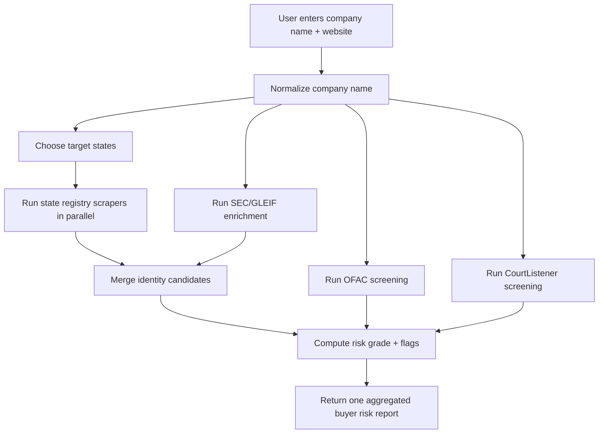

# Private Company Lookup Design

## Goal

Support US small and mid-sized private-company lookup with one input and one aggregated result.

User input:

- company name
- optional website
- optional state hint

System output:

- transaction risk grade: `A | B | C | D`
- risk flags
- basic company profile
- identity check
- sanctions check
- litigation check
- source references

## Why This Exists

Current free public-company coverage is not enough for cross-border seller workflows because many US buyers are private companies and do not appear in SEC data.

The private-company solution should not ask users to run multiple searches. The backend should fan out to multiple sources and return one report.

## Product Decision

TradeGuard should treat this feature as:

- primary label: buyer risk lookup
- internal structure: identity + sanctions + litigation + optional paid business credit

Do not market the free version as full US business credit. Market it as a pre-trade buyer risk check.

## Data Source Strategy

### Layer 1: State Registry Scrapers

Use official state registry search pages when APIs are missing.

Priority states:

1. California
2. Delaware
3. New York
4. Texas

Each state source should provide, when available:

- legal entity name
- entity number / file number
- status
- formation date
- jurisdiction
- registered agent or registered office
- official detail page URL

### Layer 2: Identity Enrichment

Use current free sources to strengthen registry findings:

- GLEIF
- SEC EDGAR when matched

This layer improves:

- alias handling
- website and domain verification
- jurisdiction cross-check
- additional metadata when available

### Layer 3: Sanctions Screening

Use official OFAC SDN downloadable data.

This layer returns:

- clear / review required / matched
- top candidate names
- sanctions source reference

### Layer 4: Litigation Screening

Use CourtListener public search for first-pass litigation signals.

This layer returns:

- case count
- recent case count
- top matching public cases
- litigation status

### Layer 5: Paid Business Credit

Add later behind paid plan:

- Dun & Bradstreet
- Creditsafe

This layer should drive the strongest:

- payment reliability
- delinquency risk
- collections risk

## Request Flow

## Scraper Architecture

Create one provider per state:

- `CaliforniaRegistryScraper`
- `DelawareRegistryScraper`
- `NewYorkRegistryScraper`
- `TexasRegistryScraper`

Each provider should implement:

- `searchByName(companyName)`
- `fetchDetails(candidate)`
- `normalizeResult()`

Shared support modules:

- `BrowserPoolService`
- `RegistryHtmlParser`
- `RegistryResultRanker`
- `RegistryCacheService`

## Runtime Design

### Step 1: Fast Fan-Out

Run low-cost checks first:

- current SEC/GLEIF lookup
- OFAC screening
- CourtListener lookup

### Step 2: Registry Fan-Out

Choose registry targets by:

- explicit `company_state`
- website TLD hint
- prior cached match
- default priority list when state is unknown

### Step 3: Merge and Rank

Use:

- normalized legal name score
- alias score
- website-domain score
- state hint boost
- registry-status boost

### Step 4: Return One Report

Do not expose provider complexity to the user.

## Risk Flags For Private Buyers

Add or retain these flags:

- `STATE_REGISTRY_NOT_FOUND`
- `INACTIVE_ENTITY`
- `NON_GOOD_STANDING`
- `MISSING_AGENT_ADDRESS`
- `RECENT_ENTITY_FORMATION`
- `WEBSITE_MISMATCH`
- `OFAC_POTENTIAL_MATCH`
- `ELEVATED_LITIGATION_ACTIVITY`
- `RECENT_LITIGATION_ACTIVITY`
- `LOW_MATCH_CONFIDENCE`

## Caching Rules

Use cache aggressively to reduce scraping load.

Recommended:

- registry search cache: 24 hours
- registry detail cache: 7 days
- OFAC dataset cache: 6 hours
- litigation cache: 24 hours

## Operational Rules

Respect source stability.

- use low request rates
- cache before refetching
- back off on failures
- log provider blocks separately
- avoid bypass tooling or anti-bot evasion logic in MVP

If a source blocks automation, degrade gracefully and keep the rest of the report available.

## MVP Engineering Plan

### Phase 1

- keep current SEC + GLEIF
- keep OFAC + CourtListener
- add crawler framework
- add California registry scraper first
- return `STATE_REGISTRY_NOT_FOUND` instead of total failure when other layers still have signals

### Phase 2

- add Delaware
- add New York
- add Texas
- add better entity ranking and alias handling

### Phase 3

- add paid business credit layer
- expose paid payment-risk result separately from free risk result

## Acceptance Criteria

- one user input triggers all checks
- one response returns identity, sanctions, litigation, and aggregate result
- private-company queries do not depend on SEC-only coverage
- if registry scraping fails, the API still returns partial report with clear source gaps
- source references are preserved for review

## Engineering Recommendation

Build private-company lookup as a crawler-backed identity layer, not as a single-source credit API.

That gives TradeGuard a useful free buyer-risk product now and leaves room for paid commercial credit later.
